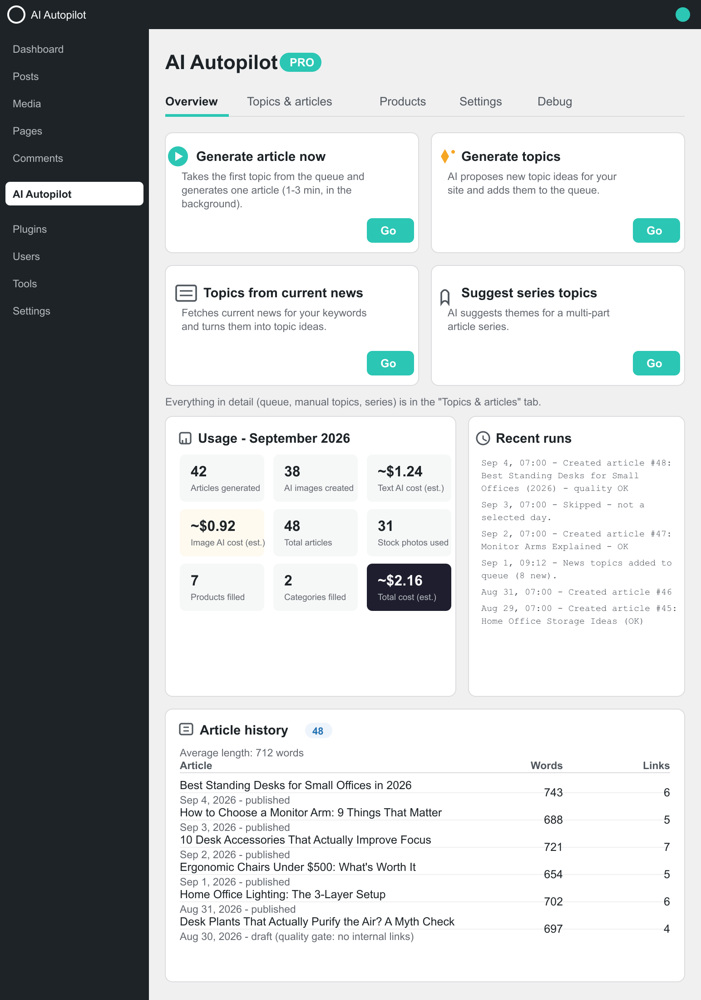
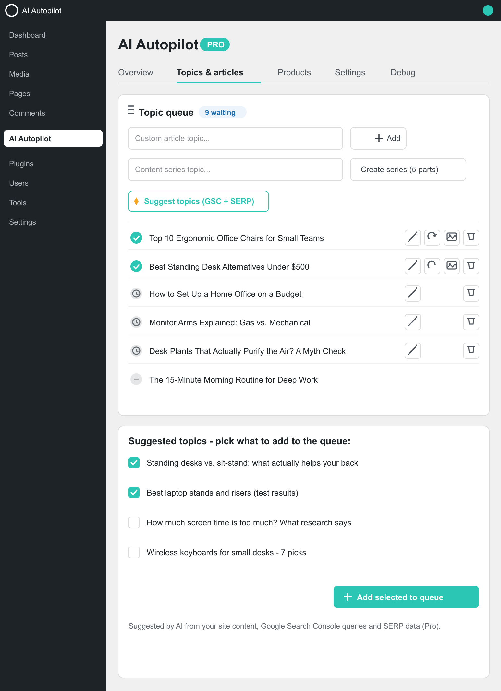
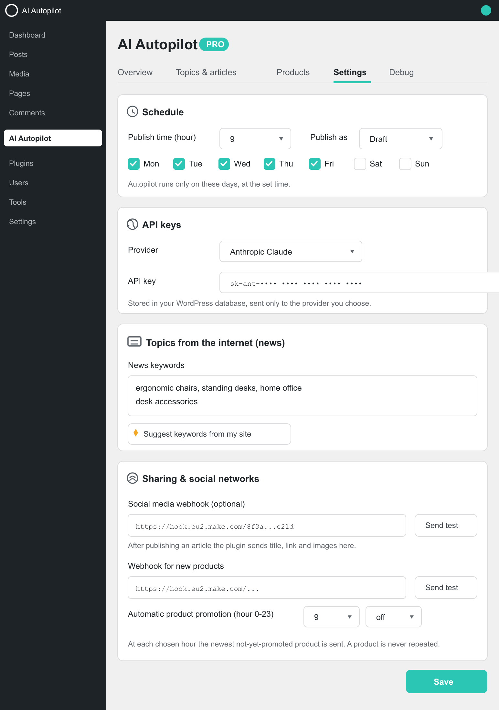

# Jookas AI Autopilot for WordPress

**Your content autopilot.** Every day it picks a topic, writes a full SEO article — outline first, then text, then an AI proofread pass — adds relevant images, links your products and articles into the text, fills the SEO fields of your plugin (Yoast, Rank Math, SEOPress, AIOSEO) and publishes on your schedule. Any niche, any language.

*Action cards, monthly AI usage and article history in one screen.*

*The topic queue with statuses, plus AI-suggested topics ready to add with one click.*

*Schedule, API keys, news keywords and social sharing — everything organized in tabs.*

## What it does

**Writing pipeline.** Outline → full article → AI proofread pass, so you get finished text, not raw drafts. Regenerate the text or swap the image of any published article with one click. The quality gate flags articles missing internal links and saves them as drafts for review instead of publishing broken content.

**Topics & scheduling.** Topics come from your niche keywords and/or fresh news headlines (Google News RSS). Near-duplicate topics are skipped automatically. Schedule by exact hour and days of the week — publish live, save as draft, or require approval before going out.

**Images.** Free stock photos from Pexels / Pixabay / Openverse with automatic variation so the same photo doesn't repeat across articles — or AI image generation (Gemini Flash Image / GPT Image) using your own API key instead of stock photos.

**SEO & distribution.** Meta title, description and keywords are pushed to Yoast, Rank Math, SEOPress or AIOSEO. Articles get internal links to your existing content plus relevance-based product CTAs — a post only links products that actually match its topic; when nothing matches, the button points to your contact page instead of a random product. New posts are announced via IndexNow and a sitemap ping so search engines find them fast.

**Social publishing.** Webhooks for Facebook / Instagram / Pinterest: connect any Make.com, Buffer or Zapier endpoint and every published article is promoted automatically with AI-written post text that includes matching products.

**Insights.** Monthly usage dashboard (articles, images, estimated API cost) with the full history of all recorded months, a recent-runs log and per-article details.

## Free version

Everything above ships in the free plugin:

- Unlimited AI articles per month (fair use — the counters never block generation), as drafts or live on schedule
- Any single AI provider of your choice: Anthropic Claude, OpenAI, Google Gemini or OpenRouter (200+ models behind one key)
- Images from free stock libraries **or** AI image generation with your own API key
- Content series (multi-part article plans), social webhooks + auto product promotion, news-based topics
- SEO fields for all four major plugins, internal links, article style templates
- Bilingual UI (English / Slovak)

## Jookas AI Autopilot Pro

Pro is a separate plugin — the free version stays fully functional on its own. Pro adds:

- **Product content from photos** — bulk import with preview & approval, product descriptions generated from your product images
- **Category descriptions and images** for your shop's categories
- **SERP research suggestions** (Serper.dev) — AI topic and series ideas based on what actually ranks in search results
- **Google Search Console queries as article topics** (OAuth)

14-day free trial, no credit card required. [Get Pro →](https://checkout.freemius.com/plugin/38271/plan/65500/)

| | Free | Pro (separate plugin) |
|---|---|---|
| AI articles per month | Unlimited (fair use), draft or **live on schedule** | Same |
| AI provider | Claude / OpenAI / Gemini / OpenRouter — one of your choice | Same |
| Images | Stock photos **or** AI generation with your own key | Same, plus product & category content from photos |
| Content series | Multi-part article plans included | + SERP-based topic & series suggestions (Serper.dev) |
| Topics | Your keywords + Google News RSS | + GSC queries as topics |
| E-commerce | Relevance-based product links in articles | Product-from-photo bulk import, category descriptions & images |
| Social | Webhooks (Make.com / Buffer / Zapier) + auto promotion + AI post text | Same |

## Install

1. Download the latest release zip (`jookas-ai-autopilot-free-X.X.X.zip`) from [Releases](https://github.com/jookySK/ai-autopilot/releases), or install **Jookas AI Autopilot** from [WordPress.org](https://wordpress.org/plugins/jookas-ai-autopilot/)
2. Upload, activate and complete the short setup wizard (brand, language, API key)
3. Add your niche keywords and pick a schedule — done. It writes, checks and publishes for you

Get an API key from [Anthropic](https://console.anthropic.com/) · [OpenAI](https://platform.openai.com/api-keys) · [Google AI Studio](https://aistudio.google.com/app/apikey) · [OpenRouter](https://openrouter.ai/keys).

## Privacy

Your API keys are stored only in your own WordPress database and sent only to the AI provider you selected, when generating content. Your articles and settings are never collected by us. Every external connection (stock photo APIs, Google News RSS, IndexNow, sitemap ping, Freemius for Pro licensing) is documented with terms & privacy links in the [plugin readme](https://wordpress.org/plugins/jookas-ai-autopilot/).

## Links

- **WordPress.org:** https://wordpress.org/plugins/jookas-ai-autopilot/
- **Releases (free zip):** https://github.com/jookySK/ai-autopilot/releases
- **Pro (separate plugin, via Freemius):** [Get Pro](https://checkout.freemius.com/plugin/38271/plan/65500/)

## License

GPLv2 or later — see the [plugin readme](https://wordpress.org/plugins/jookas-ai-autopilot/) for the full changelog.
